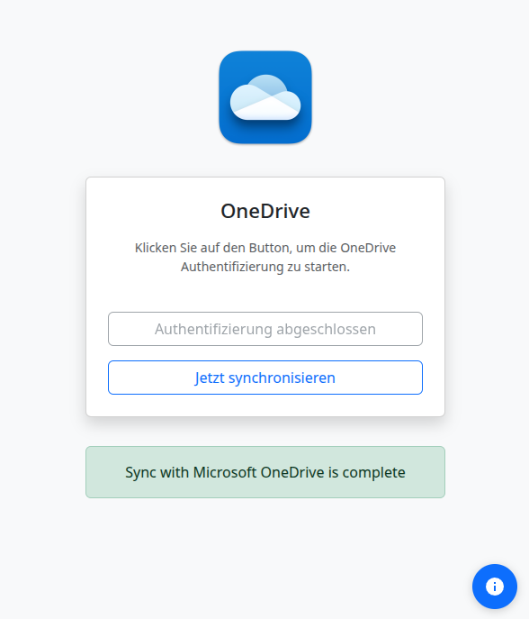

# OneDrive Authentication - Electron App

This Electron app solves OneDrive authentication with `onedrive` (abraunegg) through a user-friendly GUI.


## Solution

This Electron app provides:
- **Automatic browser opening**: The auth window opens automatically
- **URL handoff**: Automatically detects and forwards the auth URL
- **User-friendly GUI**: No manual URL entry required

## Usage

1. **Start the app**:
   ```bash
   npm run dev
   ```

2. **OneDrive authentication**:
   - Click "Start OneDrive Authentication"
   - A browser window opens automatically
   - Sign in with your Microsoft account
   - The app detects the redirect and closes the window

3. **Monitor status**:
   - All steps are shown in the status history
   - Click the info icon for detailed messages

## Technical Details

### Architecture

```
Electron Main Process (index.js)
├── OneDrive Auth Process (spawn)
├── Auth Window (BrowserWindow)
└── URL Handling (will-navigate)
```

### Workflow

1. **Start auth process**: `onedrive --auth-files request:response`
2. **Wait for URL**: Watch the `request.url` file
3. **Open browser**: Automatically load the auth URL
4. **Detect redirect**: Automatically detect the response URL
5. **Save response**: Write to `response.url`

### Files

- `index.js`: Main process with OneDrive integration
- `index.html`: User interface
- `preload.js`: IPC bridge

## Configuration

The app uses the default OneDrive configuration:
- Config directory: `~/.config/onedrive`
- Auth files: `~/.config/onedrive/auth/request.url` and `response.url`

## Requirements

- `onedrive` (abraunegg) must be installed
- Node.js and npm
- Electron

## Build

```bash
npm run build
```

Creates an AppImage for Linux.

